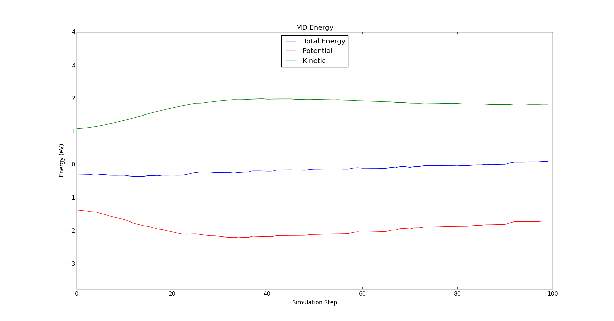
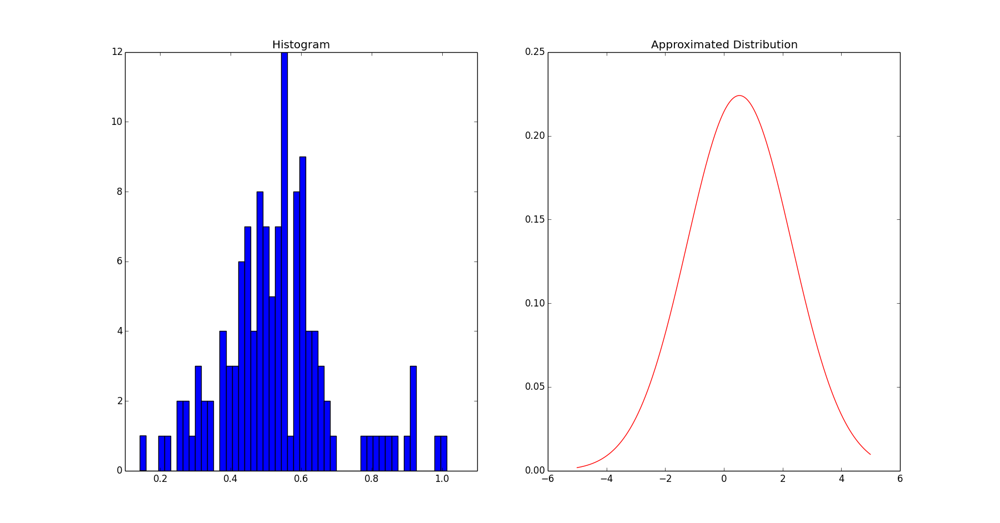

# Xin Chen's Molecular Dynamic

作者：陈欣
学号：2013311127

## 1. 代码说明

本软件的主体是用C语言编写。部分结果展示的代码由python编写。下面分别介绍这两大部分。

#### 1.1 C代码

1. xcmd.c包含了分子动力学模拟的核心逻辑与代码；
2. fileio.c主要负责文件的读与写；
3. datatype.c定义了XCMD中唯一的公共数据结构xcmd_object_t；
4. unit.c负责约化单位与SI单位的转化；
5. global.c包含了一些全局函数与变量；
6. motion.c负责求解运动方程(equation of motion)；
7. leapfrog.c包含了用于更新原子速度的leap frog算法；
8. velocity.c中包含了初始化粒子运动速度的init方法以及求解当前的动能的方法；
9. lj.c包含了Lenard-Jones势能及力的函数；
10. anderson.c包含了Anderson thermostat算法；

#### 1.2 Python代码

1. md.py用来生成XCMD可用的输入文件，无特殊package依赖；
2. mdplot.py可以读取XCMD生成的.out文件并且绘制动能、势能与总能量的变化曲线，需要matplotlib；
3. velocity.py用来绘制给定体系的速度分布，需要scipy和matplotlib；

## 2. 编译与使用

#### 2.1 编译方法

XCMD并没有引入任何第三方的函数库，因此任意支持c99标准的C编译器均可以编译本软件。在XCMD/XCMD目录下已经包含了编译所需的makefile。只需要cd至该目录并make即可。编译将会生成名叫MD的可执行文件。

#### 2.2 使用方法

1. 使用md.py生成输入文件或者参照所给的input.txt手动生成输入文件；
2. cd至MD所在目录
3. ./MD path_to_input.txt path_to_output

#### 2.3 输出文件

1. .out包含了每一步的能量，温度，压强；
2. .fout包含了特定步数的configuration的原子受力；
3. .vout包含了特定步数的configuration的原子速度；
4. .pout包含了特定步数的configuration的原子坐标；

## 3. 分子动力学模拟样例

1. 输入文件：input.txt
2. 构型说明：125个Ar原子，初始间隔为1.0 (3.4E-10 m)，初始温度为10K，box边长为5.0，每一步的时间为0.002，总模拟步数为100

##### 能量－步数变化曲线

##### 速度分布曲线

注：这个曲线是由第30步的configuration绘制！